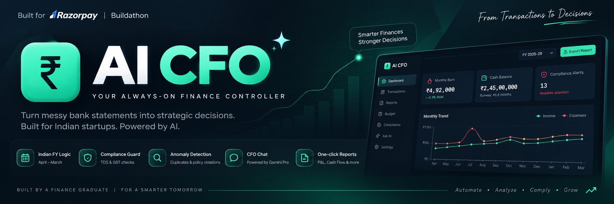

  

# AI-CFO: The Intelligent Finance Controller 🇮🇳

## 🚀 Live Demo
[https://preview--ai-cfo-buddy-20.lovable.app/]

## 📺 Watch the 5-Minute Demo [Click Here](https://drive.google.com/file/d/1plyIrCGIT-qp8aqQPsu9ghnJcKzOq0ik/view?usp=drive_link)

## 📌 Project Overview
AI-CFO is a next-generation finance controller built for the **Razorpay Buildathon**. As a Finance Graduate, I designed this tool to bridge the gap between messy bank statements and strategic CFO-level decision-making.

### Key "Finance-First" Features:
- **Indian FY Logic:** Automatically structures data into the April-March Financial Year.
- **Compliance Guard:** Flags payments >₹30k for TDS checking and detects GST-missing entries.
- **Audit Anomaly Detection:** Uses AI to find duplicate vendor payments and policy violations (e.g., Sunday spends).
- **CFO Chat (Gemini Pro):** Ask complex questions like "Can we afford to hire 2 people?" or "Why did costs spike in July?"
- **Professional Reports:** One-click export for P&L and Cash Flow statements.

## 🛠️ Tech Stack
- **AI:** Google Gemini API
- **Frontend:** React + Tailwind CSS
- **Platform:** Lovable / GitHub

## 🧑‍🎓 About the Author
Built by a Finance Graduate with a passion for AI. I focused on making the accounting logic 100% accurate for the Indian startup ecosystem.
